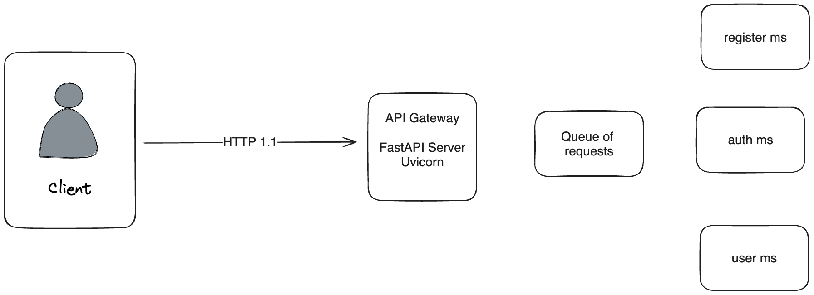

# HOLA APP

Приложение в сфере e-commerce. 
Представляет из себя платформу с элементами социальной сети для продавцов и покупателей.

Это центральный репозиторий приложения, которой содержит только описание.
Приложение реализуется на основе микросервисной архитектуры.

# Подмодули
Подробнее см. [Инструменты Git: Подмодули](https://git-scm.com/book/ru/v2/%D0%98%D0%BD%D1%81%D1%82%D1%80%D1%83%D0%BC%D0%B5%D0%BD%D1%82%D1%8B-Git-%D0%9F%D0%BE%D0%B4%D0%BC%D0%BE%D0%B4%D1%83%D0%BB%D0%B8)
### Клонирование

Чтобы клонировать репозиторий, включая все подмодули, выполните:
```
git clone --recurse-submodules https://github.com/raphaelgolubev/hola-api
```

### Добавление нового подмодуля

Для добавления нового подмодуля, выполните:
```
git submodule add <ссылка на репозиторий> 
```

### Обновление
Следующая команда перейдет в подмодули, получит изменения и обновит их для вас:
```
git submodule update --remote
```
По умолчанию, команда предполагает, что вы хотите обновить локальную копию до состояния
ветки `master` из репозитория подмодуля. Если вы хотите отслеживать другую ветку, выполните:
```
git config -f .gitmodules submodule.<имя подмодуля>.branch <ветка>
```
или задайте название ветки вручную в файле `.gitmodules`:
```
[submodule "<имя подмодуля>"]
branch = <ветка>
```

### Настройка Git
Если вы хотите, чтобы `git status` отображал краткое резюме об изменениях в подмодулях, выполните:
```
git config status.submodulesummary 1
```

Если вы не хотите каждый раз добавлять опцию `--submodule` в команде `git diff`, выполните:
```
git config diff.submodule log
```

# Сборка и запуск

Про локальный запуск, сборку, CI/CD и тд

# Схема проекта



- API Gateway (API-шлюз): ...
- Load Balancer (Балансировщик нагрузки): ...

