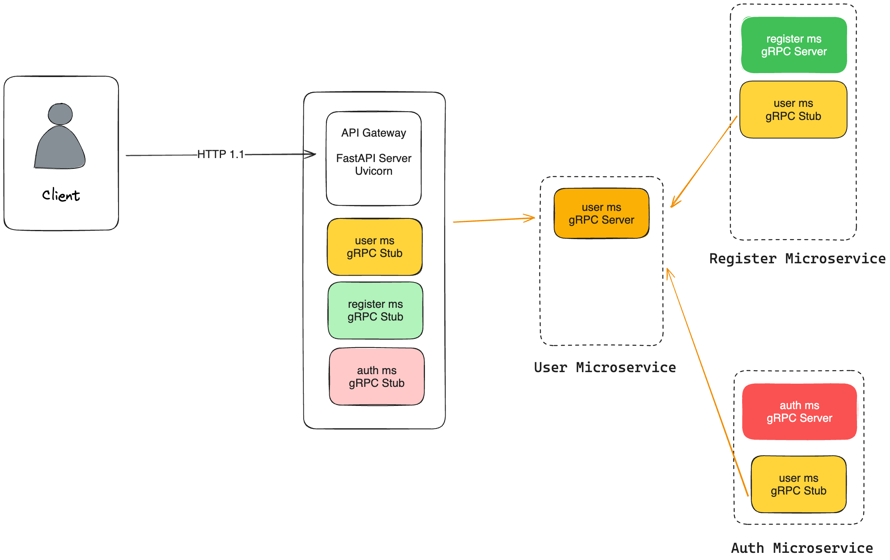
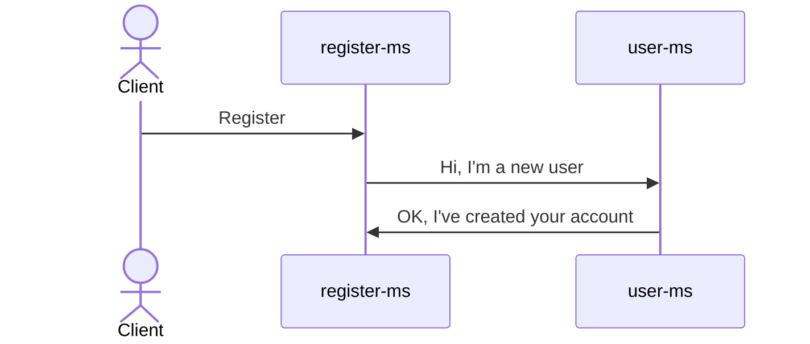

# HOLA API

REST API для приложения в сфере e-commerce. Представляет из себя платформу с элементами социальной сети для продавцов и покупателей.

# Структура проекта
Проект состоит из следующих микросервисов:
- `user-ms`: Микросервис, который реализует методы создания, чтения, обновления и удаления пользователей в своей локальной базе данных. Также может содержать дополнительные методы для работы с пользователями.

- `register-ms`: Микросервис, который реализует флоу регистрации пользователей, обращается к микросервису `user-ms` для создания пользователя и к микросервису `notifications-ms` для отправки кода подтверждения.

- `notifications-ms`: Микросервис, реализующий методы нотификации пользователей по почте, по номеру телефона и тд.

- `auth-ms`: Микросервис, реализующий методы идентификации, аутентификации и авторизации пользователей. Обращается к микросервису `user-ms` для получения информации о пользователе.

В качестве единой входной точки для клиентов используется FastAPI сервер:
- `hola-api-gateway`: FastAPI сервер, который обрабатывает запросы от пользователей и передает их в микросервисы. Может
выполнять балансировку нагрузки и маршрутизации.

# Подмодули
Подробнее см. [Инструменты Git: Подмодули](https://git-scm.com/book/ru/v2/%D0%98%D0%BD%D1%81%D1%82%D1%80%D1%83%D0%BC%D0%B5%D0%BD%D1%82%D1%8B-Git-%D0%9F%D0%BE%D0%B4%D0%BC%D0%BE%D0%B4%D1%83%D0%BB%D0%B8)
### Клонирование

Чтобы клонировать репозиторий, включая все подмодули, выполните:
```
git clone --recurse-submodules https://github.com/raphaelgolubev/hola-api
```

### Добавление нового подмодуля

Для добавления нового подмодуля, выполните:
```
git submodule add <ссылка на репозиторий> <название подмодуля>
```

### Обновление
Следующая команда перейдет в подмодули, получит изменения и обновит их для вас:
```
git submodule update --remote
```
По умолчанию, команда предполагает, что вы хотите обновить локальную копию до состояния
ветки `master` из репозитория подмодуля. Если вы хотите отслеживать другую ветку, выполните:
```
git config -f .gitmodules submodule.<имя подмодуля>.branch <ветка>
```
или задайте название ветки вручную в файле `.gitmodules`:
```
[submodule "<имя подмодуля>"]
branch = <ветка>
```

### Получение изменений

Чтобы получить изменения в подмодулях и обновить их локально, выполните:
```
git pull && git submodule update --init --recursive
```
или 
```
git pull --recurse-submodules
```

### Публикация изменений

Чтобы публиковать изменения в подмодулях, выполните:
```
git push --recurse-submodules=on-demand
```
Перед тем как отправить изменения основного проекта данная команда попытается перейти во все подмодули и запушить их изменения.

### Команда foreach
Команда `foreach` позволяет выполнить произвольную команду в каждом подмодуле:
```
git submodule foreach '<команда>'
```
Например, временно сохранить изменения, не фиксируя их в коммте для всех подмодулей:
```
git submodule foreach 'git stash'
```

### Настройка Git
Если вы хотите, чтобы `git push` завершался ошибкой, если какой-то из подмодулей не был отправлен на сервер, выполните:
```
git config push.recurseSubmodules check
```
или, в случае, если вы хотите, чтобы `git push` автоматически публиковал изменения всех подмодулей перед отправкой основного проекта, выполните:
```
git config push.recurseSubmodules on-demand
```

Если вы хотите, чтобы Git всегда добавлял опцию `--recurse-submodules` к командам (кроме `clone`), выполните:
```
git config submodule.recurse true
```

Если вы хотите, чтобы `git status` отображал краткое резюме об изменениях в подмодулях, выполните:
```
git config status.submodulesummary 1
```

Если вы не хотите каждый раз добавлять опцию `--submodule` в команде `git diff`, выполните:
```
git config diff.submodule log
```

# Сборка и запуск

Про локальный запуск, сборку, CI/CD и тд

# Схема проекта



- API Gateway (API-шлюз): ...
- Load Balancer (Балансировщик нагрузки): ...

# Mermaid тест


